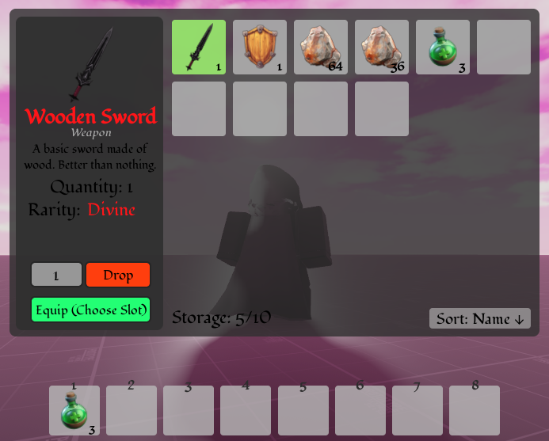

# Modular Inventory & Item System
<p align="left">
  
</p>

A comprehensive inventory and item management system for Roblox, built with scalability and maintainability in mind.
## Features
### Inventory Management
- **Dynamic Grid System**: Scrolling inventory with configurable slot capacity
- **Smart Stacking**: Automatic item stacking with comfigurable stack limits
- **Hotbar Integration**: Quick-access hotbar with keybind support (1-8 keys)
- **Item Details Panel**: In-depth item information with equip/drop actions and item rarities
- **Item Sorting Modes**: Items can be sorted by None, Name, Quantity, Rarity, or Type, in both ascending and descending order

### Item System
- **Flexible Pickup Modes**:
    - **Shared**: Server-sided, first player to pick up claims the item
    - **Respawning**: Items respawn after a configurable cooldown period
    - **Instanced**: Each player can pick up their own copy (ideal for quest systems, etc)
- **Type-Safe Item Definitions**: Weapons, consumables, materials, armour, and quest items
- **Proximity-Based Pickups**: Intuitive interaction with world items whilst maintaining security
- **Easy Item Implementation**: Easy to add new items with custom rarities, stats, types and more

### Architecture
- **Server-Authoritative**: All game logic validated server-side to prevent exploits
- **Clean Separation of Concerns**: Data, logic, and presentation layers are isolated
- **Modular Design**: Features organised by system for easy maintenance and extension
- **Type Safety**: Full Luau type annotations throughout codebase

## Project Structure
- ReplicatedStorage/
    - Shared/
        - Types/    *Type definitions*
        - Data/    *Item definitions*
        - Utils/    *Helper functions*
    - Client/
        - Inventory/    *Inventory UI and controllers*
        - Items/    *Item rendering and effects*
- ServerScriptService/
    - Inventory/    *Inventory data and logic*
        - Core/    *Data management*
        - Services/    *Business logic*
    - Items/    *Item system*
        - Core/    *Item registry and equipment*
        - Services/    *Pickup, usage and instantiation*
    - ServerInit.lua    *Server initialisation*
- StarterPlayer/
    - StarterPlayerScripts/
        - ClientInit.lua    *Client initialisation*

## Getting Started
### Creating Items
#### In ItemData.lua
Items are created in the following way, with attributes such as *equipSlot* and *damage* being examples of optional attributes for the *Weapon* itemType.
```lua
["wooden_sword"] = {
    id = "wooden_sword",
    name = "Wooden Sword",
    description = "A basic sword made of wood.",
    icon = "rbxassetid://123456789",
    itemType = "Weapon",
    rarity = "Common",
    stackLimit = 1,
    equipSlot = "MainHand",
    damage = 10,
} :: ItemData
```
#### In Workspace
1. Create an Item (must be a Model even if only one part)
2. Drop Item into ServerStorage/Items with an Id attribute
#### If you want it to be spawnable:
3. Add a Part to Workspace (I recommend under a Folder such as Workspace/Items/SpawnLocations)
4. Make sure Part is Anchored and place at desired location
5. Set attributes on item:
- `Id`: `wooden_sword` (must match ItemData)
- `Quantity`: `1` (optional, default: 1)
- `PickupMode`: `"Shared"`| `"Respawning"` | `"Instanced"` (see definitions above, default Shared)
- `RespawnTime`: `30` (only for Respawning mode)

## Usage
### For Players
- **Open Inventory**: Press `F` key (or change default `INVENTORY_KEYBIND` in InventoryController)
- **Hotbar Slots**: Press `1-8` keys to select/use items or click on hotbar slot
- **Equip to Hotbar**: Click item -> "Equip" -> Click hotbar slot
- **Pick Up Items**: Approach items in world and hold prompt when it appears
### For Developers
#### Adding to Player's Inventory (Server)
```lua
local InventoryManager = require(path.to.InventoryManager)
InventoryManager.AddItem(player, "health_potion", 5)
```
#### Getting Player's Inventory (Server)
```lua
local InventoryManager = require(path.to.InventoryManager)
local inventory = InventoryManager.GetInventory(player)
```
#### Using an Item (Server)
```lua
local ItemService = require(path.to.ItemService)
ItemService.UseItem(player, "health_potion")
```
This function is also where other systems in game can be linked for different item types usage, such as combat system etc. Systems can be linked in as such:
```lua
function InventoryService.UseItem(player: Player, inventory: PlayerInventory, itemId: string, itemIndex: number)
	local item = ItemData.Items[itemId]
	if not item then
		warn(`No item named {itemId} in ItemData for {player.DisplayName}`)
	end
	print(`{player.DisplayName} used {item.name} of type {item.itemType}`)
	
	-- Example functionality of how to link in to other in game systems
	if item.itemType == "Weapon" then
		-- EquipmentService.EquipWeapon(item)
	elseif item.itemType == "Armour" then
		-- EquipmentService.EquipArmour(item)
	elseif item.itemType == "Consumable" then
		-- ConsumableService.ConsumeItem(item)
	elseif item.itemType == "Material" then
		-- CraftingService.CraftItem(item)
	elseif item.itemType == "QuestItem" then
		-- QuestService.IncrementQuest(item)
	else
		-- Item has no item type, add handling here
	end
end
```